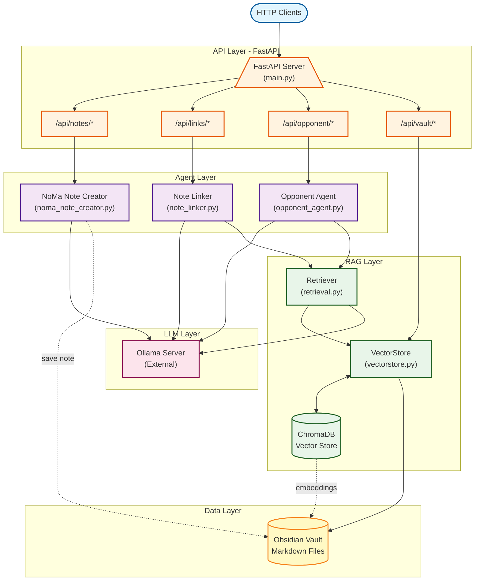

# The Opponent Framework Backend

Well... most of the explanation is in the main README.md file at the root of the repository. But because for some reason that I was way to lazy to understand, `uv` asks for a README.md file in this folder, so... here is a quick overview of the backend architecture, styled by the ~not~ always reliable Claude:

